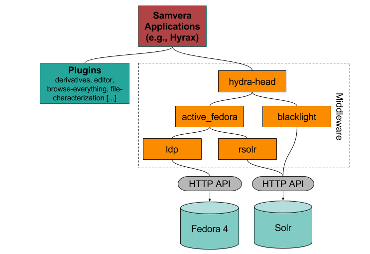

# CU Scholar

CU Scholar is the University of Colorado Libraries Institutional Repository. The repository is using [Samvera](https://samvera.org/samvera-open-source-repository-framework) an open source repository framework. 

## Samvera Technical Stack

## Infrastructure

CU Scholar utilizes the CU Library [infrastructure](/policies/infrastructure/infrastructure). 

## CU Scholar Components

1. Hyrax  [https://github.com/culibraries/ir-scholar](https://github.com/culibraries/ir-scholar)
2. Ruby gems [https://github.com/culibraries/ir-scholar/blob/master/Gemfile](https://github.com/culibraries/ir-scholar/blob/master/Gemfile)
3. Fedora 4.7 [https://duraspace.org/fedora/](https://duraspace.org/fedora/)
    * Fedora [features](https://duraspace.org/fedora/resources/publications/fedora-digital-preservation/)
    * Metadata stored within Mysql Relational Database - [AWS RDS](https://aws.amazon.com/rds/aurora/serverless/)
4. Solr 6.x [https://solr.apache.org/](https://solr.apache.org/)

### Metadata

CU Scholar metadata is stored within the Flexibile Extensible Digital Object Repository Architecture(fedora). The metadata utilizes the Mysql AWS RDS database. Fedora logs all changes and stores metadata changes within the database. [Backup Policy](/policies/backup) (CTS 4)

### Data Files

CU Scholar data files are stored within the Flexibile Extensible Digital Object Repository Architecture(fedora). The production data files are stored within AWS S3 object storage service. [Backup Policy](/policies/backup) (CTS 3 (offsite copy to PL implementation phase))

### Data File Checks

1. All files uploaded undergoes virus scan.(CTS 4)
2. Fixity checksum are performed on a regular intervals. MONTHLY/Quaterly/Year(???) timeframe.(CTS 3)

### Horizontal Scalable

Kubernetes provides container orchestration with the ability to scale horizontally. CU Scholar has the ability to adjust capacity based on demand.  

